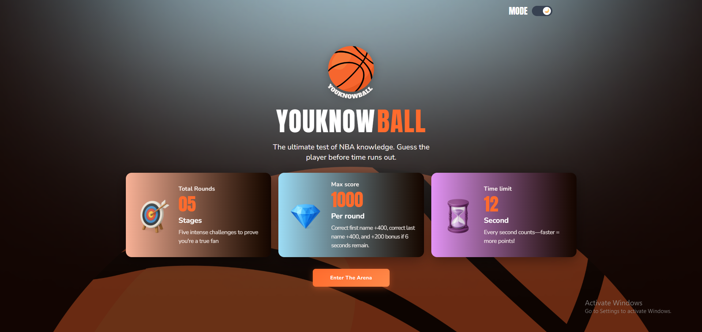
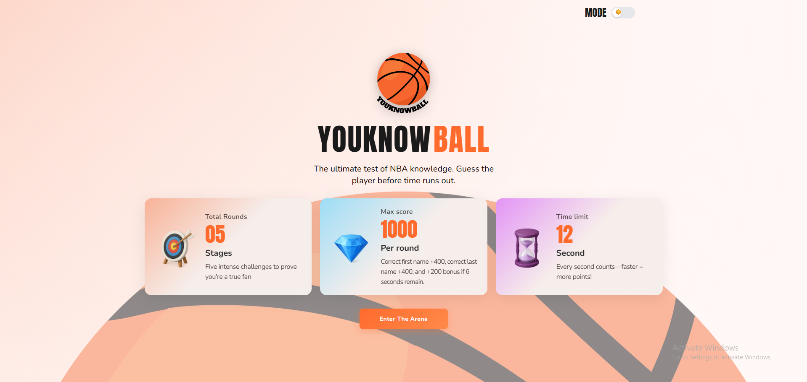
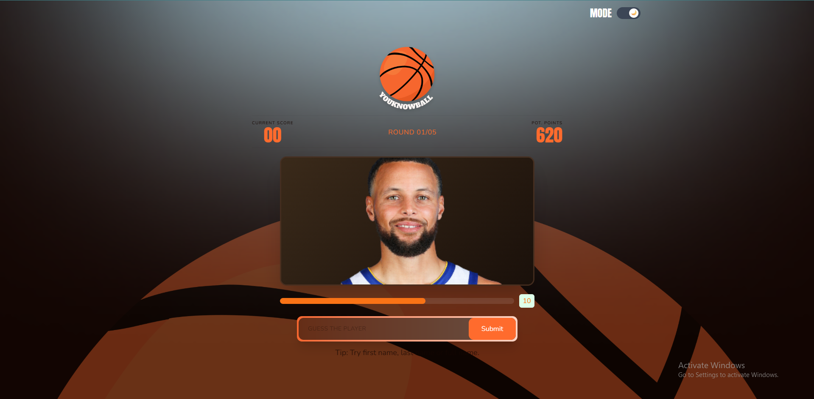
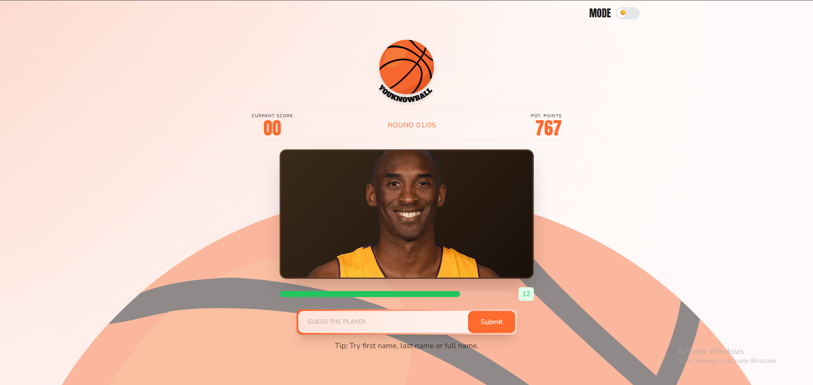
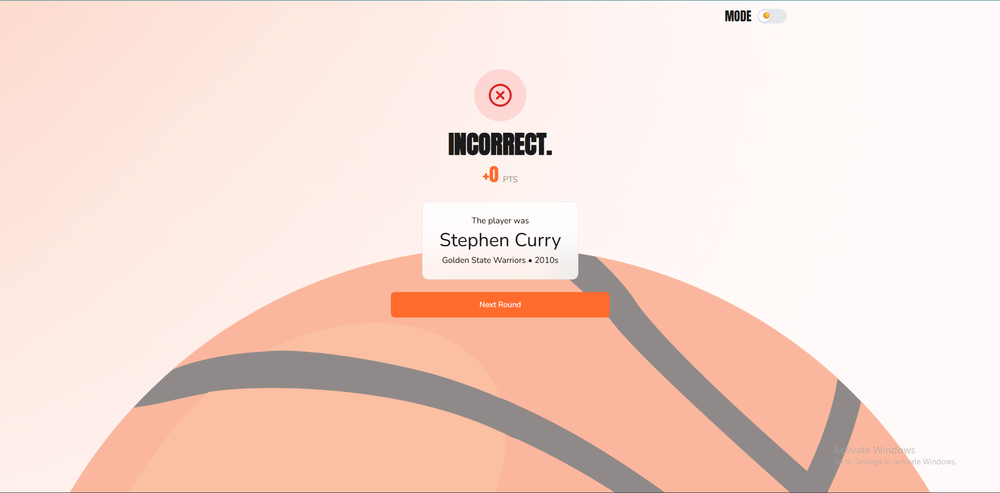
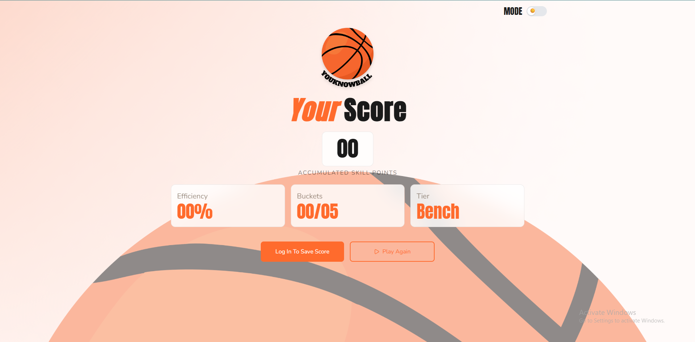
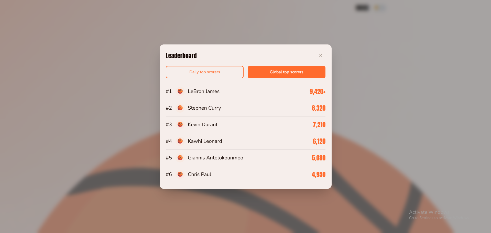

# 🏀 NBA Player Guessing Game

A fast-paced, interactive React-based guessing game where players test their knowledge of NBA players by identifying them from their images. Built with React 19, Vite, and Tailwind CSS.

## 🎮 How the Game Works

The NBA Player Guessing Game is a real-time guessing challenge where you have **5 rounds** to identify as many NBA players as possible.

### Game Mechanics

**Each Round:**
- 15 seconds on the clock
- An NBA player image is displayed
- Type the player's first and/or last name to make your guess
- The faster you guess, the more points you earn!

### 📊 Scoring System

Points are based on accuracy and speed:

| Accuracy | Points | Description |
|----------|--------|-------------|
| **Perfect** | Up to 1000 | Both first AND last name correct |
| **Partial** | Up to 500 | Either first OR last name correct |
| **Incorrect** | 0 | Player name not recognized |

**Maximum Game Score:** 5,000 points (1,000 points × 5 rounds)

### 🏆 Performance Tiers

Your final score determines your tier based on efficiency:

| Efficiency | Tier | Status |
|-----------|------|--------|
| 90%+ | **GOAT** | Greatest of All Time |
| 70-89% | **MVP** | Most Valuable Player |
| 50-69% | **All-Star** | Elite Performer |
| 30-49% | **Starter** | Solid Player |
| 10-29% | **Rookie** | Newcomer |
| <10% | **Bench** | Keep Practicing |

## 🎯 How to Play

### Step 1: Start the Game
Click the "Play" button on the home page to begin your guessing challenge.

| Dark Theme | Light Theme |
|-----------|------------|
|  |  |

### Step 2: View the Player
Each round displays a player's image. Study their appearance carefully!

| Dark Theme | Light Theme |
|-----------|------------|
|  |  |

### Step 3: Make Your Guess
- Type the player's **first name**, **last name**, or **both**
- Names are case-insensitive
- Press **Enter** or click **Submit** to lock in your guess

### Step 4: Earn Points
Instant feedback shows you:
- Whether your guess was **Perfect**, **Close**, or **Incorrect**
- The points you earned for that round
- Your cumulative score



### Step 5: Continue Through All Rounds
After each round, advance to the next player. Complete all 5 rounds to finish the game.

### Step 6: View Your Results
After completing all 5 rounds, check your:
- **Total Score** (0-5,000)
- **Performance Tier** (GOAT to Bench)
- **Leaderboard** to see how you rank against other players
- **Accuracy** (number of perfect guesses)



## 🏆 Leaderboard

Track your performance and compete with other players on the global leaderboard. See where you rank based on:

- **Total Score** - Your final game score
- **Performance Tier** - GOAT to Bench ranking  
- **Accuracy Rate** - Percentage of correct guesses
- **Personal Best** - Your highest score ever



## ✨ Features

- **Real-Time Scoring** - Watch your points accumulate instantly
- **Interactive Feedback** - Get immediate results on each guess
- **Sound Effects** - Audio feedback for perfect guesses
- **Dark/Light Theme** - Toggle between themes for comfortable viewing
- **Responsive Design** - Play on desktop, tablet, or mobile
- **Leaderboard** - Compete with other players and track rankings
- **NBA Player Database** - Guess from a curated collection of legendary NBA players

## 🚀 Quick Start

### Prerequisites

- Node.js 16+
- npm or yarn

### Installation

1. Clone the repository:
```bash
git clone <repository-url>
cd guessingGame
```

2. Install dependencies:
```bash
npm install
```

3. Create environment file:
```bash
cp .env.example .env
```

4. Configure your environment variables:
```env
VITE_API_BASE_URL=http://localhost:3000/api
VITE_APP_NAME=NBA Guessing Game
```

5. Start the development server:
```bash
npm run dev
```

The application will be available at `http://localhost:5173`

## 📦 Available Scripts

- `npm run dev` - Start development server with Vite
- `npm run build` - Build for production
- `npm run preview` - Preview production build locally
- `npm run lint` - Run ESLint to check code quality
- `npm run format` - Format code with Prettier

## 📁 Game Project Structure

```
src/
├── components/              # Reusable UI components
│   ├── Navbar.jsx          # Navigation bar with theme toggle
│   ├── LeaderboardModal.jsx # Display rankings
│   ├── ThemeToggle.jsx      # Dark/light theme switcher
│   └── ui/                 # Basic UI components
├── config/
│   ├── constants.js        # Game constants (rounds, duration, etc.)
│   └── env.js             # Environment configuration
├── data/
│   └── players.js          # NBA players database
├── pages/public/game/
│   ├── GameView.jsx        # Main game component
│   ├── game.css           # Game styling
│   └── sections/
│       ├── Result.jsx      # Result display after guess
│       └── Score.jsx       # Score display during game
├── router/
│   └── router.jsx          # Route configuration
├── services/               # API communication
│   ├── axiosInstance.js
│   └── httpMethods.js
└── utils/
    ├── cookies.js
    ├── storage.js
    └── validators.js
```

## 🎮 Game Constants

The game is configured with the following constants (in `src/config/constants.js`):

- **ROUNDS**: 5 rounds per game
- **DURATION**: 15 seconds per round
- **MAX_PER_ROUND**: 1,000 points maximum per round
- **TOTAL_SCORE**: 5,000 points maximum

## 👥 NBA Players Database

The game features legendary NBA players stored in [src/data/players.js](src/data/players.js):

- LeBron James
- Stephen Curry
- Michael Jordan
- Kobe Bryant
- Kevin Durant

You can easily add more players to expand the game database!

## 🌙 Theme System

The game supports dark and light themes with automatic persistence to localStorage:

- **Light Theme** - Clean, bright interface perfect for daytime
- **Dark Theme** - Easy on the eyes for comfortable gaming sessions
- **Toggle Button** - Located in the Navbar for easy access

## 📊 Scoring Algorithm

The scoring system rewards speed and accuracy:

```
Points = (Time Remaining / Total Duration) × 1000 × Accuracy Multiplier

Where Accuracy Multiplier is:
- 1.0 for perfect guesses (both names)
- 0.5 for partial guesses (one name)
- 0.0 for incorrect guesses
```

## 🚀 Development

### Starting the Development Server

```bash
npm run dev
```

The server runs on `http://localhost:5173` with hot module reloading enabled.

### Building for Production

```bash
npm run build
```

Creates an optimized production bundle in the `dist/` directory.

### Running Linting

```bash
npm run lint
```

Checks code quality using ESLint.

### Code Formatting

```bash
npm run format
```

Formats code using Prettier for consistent style.

## 🎨 Technologies Used

- **React 19** - Latest React with hooks
- **Vite** - Ultra-fast build tool
- **Tailwind CSS 4** - Utility-first styling
- **React Router v7** - Client-side routing
- **Lucide React** - Icon library
- **JavaScript ES6+** - Modern JavaScript

## 📱 Responsive Design

The game is fully responsive and optimized for:

- 📱 **Mobile** (320px and up)
- 📲 **Tablets** (768px and up)
- 💻 **Desktop** (1024px and up)

All UI elements scale beautifully across devices.

## 🚀 Deployment

### Prerequisites for Deployment

1. Have Node.js 16+ installed
2. Project built successfully with `npm run build`
3. Environment variables properly configured

### Deploy to Vercel

```bash
npm install -g vercel
vercel
```

### Deploy to Netlify

```bash
npm run build
# Upload the dist/ folder to Netlify
```

### Deploy to GitHub Pages

```bash
npm run build
# Deploy the dist/ folder to gh-pages branch
```

## 📝 Tips for Better Gameplay

1. **Study the Images** - Take time to carefully examine each player's face
2. **Know Your NBA History** - Players span different eras (90s to 2010s)
3. **Speed Counts** - Don't hesitate; guessing quickly earns more points
4. **Partial Guesses** - If unsure, guessing just a first or last name is better than nothing
5. **Practice** - Play multiple games to build familiarity with the players

## 🐛 Troubleshooting

### Game not responding
- Refresh the page
- Clear browser cache
- Check internet connection

### Sound not working
- Ensure your browser allows audio playback
- Check system volume
- Verify browser permissions for audio

### Scores not saving
- Check that localStorage is enabled in your browser
- Clear browser cache and cookies
- Try a different browser

## 📞 Support

For issues or feedback:
1. Check the browser console for error messages
2. Verify all dependencies are installed: `npm install`
3. Restart the development server: `npm run dev`

## 📄 License

This project is open source and available under the MIT License.

## 🤝 Contributing

1. Fork the repository
2. Create a feature branch: `git checkout -b feature/amazing-feature`
3. Commit your changes: `git commit -m 'Add amazing feature'`
4. Push to the branch: `git push origin feature/amazing-feature`
5. Open a Pull Request

## 📄 License

This project is licensed under the MIT License - see the [LICENSE](LICENSE) file for details.

## 🙏 Acknowledgments

- [React](https://reactjs.org/) - The web framework used
- [Redux Toolkit](https://redux-toolkit.js.org/) - State management
- [Tailwind CSS](https://tailwindcss.com/) - Styling framework
- [Vite](https://vitejs.dev/) - Build tool
- [Lucide](https://lucide.dev/) - Icon library

## 📞 Support

If you have any questions or need help getting started:

- 📧 Email: hello@reactboilerplate.dev
- 💬 Discord: [Join our community](https://discord.gg/reactboilerplate)
- 🐛 Issues: [GitHub Issues](https://github.com/your-repo/issues)
- 📖 Docs: [Documentation](https://docs.reactboilerplate.dev)

---

**Happy Coding!** 🎉
- `npm run lint` - Run ESLint to check code quality
- `npm run format` - Format code with Prettier

## 📁 Project Structure

```
src/
├── api/
│   ├── apiClient.js
│   └── endpoints/
│       └── exampleApi.js
├── app/
│   ├── store.js
│   └── rootReducer.js
├── components/
│   ├── common/
│   │   ├── Button/
│   │   │   ├── Button.jsx
│   │   │   └── index.js
│   │   ├── Input/
│   │   │   ├── Input.jsx
│   │   │   └── index.js
│   │   └── LoadingSpinner/
│   │       ├── LoadingSpinner.jsx
│   │       └── index.js
│   └── layout/
│       ├── Header/
│       │   ├── Header.jsx
│       │   └── index.js
│       └── Footer/
│           ├── Footer.jsx
│           └── index.js
├── features/
│   ├── auth/
│   │   ├── components/
│   │   ├── hooks/
│   │   ├── authSlice.js
│   │   └── authApi.js
│   ├── todos/
│   │   ├── components/
│   │   ├── hooks/
│   │   ├── todosSlice.js
│   │   └── todosApi.js
│   └── counter/
│       ├── components/
│       ├── hooks/
│       ├── counterSlice.js
│       └── counterApi.js
├── hooks/
│   ├── useDebounce.js
│   ├── useLocalStorage.js
│   └── useMediaQuery.js
├── utils/
│   ├── constants.js
│   ├── helpers.js
│   └── validators.js
├── styles/
│   └── globals.css
├── routes/
│   ├── PrivateRoute.jsx
│   └── AppRoutes.jsx
└── App.jsx
```

## 🔧 Configuration

### Tailwind CSS

The Tailwind CSS configuration is located in `tailwind.config.js`. Customize your design tokens here:

```javascript
export default {
  content: ['./index.html', './src/**/*.{js,jsx}'],
  theme: {
    extend: {
      colors: { /* ... */ },
      spacing: { /* ... */ },
    },
  },
  darkMode: 'class',
};
```

### Redux Store

Redux slices are located in `src/store/slices/`. Create new slices for different features:

```javascript
import { createSlice } from '@reduxjs/toolkit';

const initialState = { /* ... */ };

export const featureSlice = createSlice({
  name: 'feature',
  initialState,
  reducers: {
    // Add your reducers here
  },
});

export const { /* actions */ } = featureSlice.actions;
export default featureSlice.reducer;
```

Then register the slice in `src/store/store.js`:

```javascript
import featureReducer from './slices/featureSlice';

export const store = configureStore({
  reducer: {
    // ... other reducers
    feature: featureReducer,
  },
});
```

## 📝 Usage Examples

### Using Redux State

```javascript
import { useDispatch, useSelector } from 'react-redux';
import { toggleTheme } from '../store/slices/appSlice';

export default function Component() {
  const dispatch = useDispatch();
  const theme = useSelector((state) => state.app.theme);

  return (
    <button onClick={() => dispatch(toggleTheme())}>
      Current theme: {theme}
    </button>
  );
}
```

### Using UI Components

```javascript
import Button from '../components/ui/Button';
import Card from '../components/ui/Card';

export default function Example() {
  return (
    <Card>
      <h2 className="text-xl font-bold">Welcome</h2>
      <p className="mt-2 text-gray-600">Hello, World!</p>
      <Button variant="primary" size="md" className="mt-4">
        Click Me
      </Button>
    </Card>
  );
}
```

### Styling with Tailwind CSS

```javascript
export default function Component() {
  return (
    <div className="flex items-center justify-center rounded-lg bg-blue-500 px-6 py-4 text-white shadow-lg hover:bg-blue-600 dark:bg-blue-900">
      Tailwind styled component
    </div>
  );
}
```

## 🎨 Component Library

### Button

Versatile button component with multiple variants and sizes.

```javascript
<Button variant="primary" size="md">
  Primary Button
</Button>
<Button variant="secondary" size="sm">
  Secondary Button
</Button>
<Button variant="danger" size="lg">
  Danger Button
</Button>
```

**Props:**
- `variant`: `'primary'` | `'secondary'` | `'danger'` (default: `'primary'`)
- `size`: `'sm'` | `'md'` | `'lg'` (default: `'md'`)
- `className`: Additional CSS classes
- All standard HTML button attributes

### Card

Container component for grouping content.

```javascript
<Card className="max-w-md">
  <h3 className="font-bold">Card Title</h3>
  <p>Card content goes here</p>
</Card>
```

**Props:**
- `children`: Card content
- `className`: Additional CSS classes

### ThemeToggle

Component to switch between light and dark modes.

```javascript
<ThemeToggle />
```

## 🌙 Dark Mode

Dark mode is built-in using Tailwind's class-based dark mode. To enable dark mode:

```javascript
// In your component
<div className="bg-white text-gray-900 dark:bg-gray-900 dark:text-white">
  Content
</div>
```

The `ThemeToggle` component is already integrated and manages the theme state via Redux.

## 📚 Dependencies

### Core Dependencies
- **react** - UI library
- **react-dom** - DOM rendering
- **react-redux** - Redux bindings for React
- **@reduxjs/toolkit** - Redux state management

### Styling
- **tailwindcss** - Utility-first CSS framework
- **@tailwindcss/vite** - Vite plugin for Tailwind CSS
- **clsx** - Utility for constructing className strings

### Routing & HTTP
- **react-router-dom** - Client-side routing
- **axios** - HTTP client

### UI & Notifications
- **react-toastify** - Toast notifications

### Development Tools
- **vite** - Build tool
- **eslint** - Code quality
- **prettier** - Code formatter
- **prettier-plugin-tailwindcss** - Tailwind CSS class sorting

## 🛠️ Best Practices

1. **Component Organization** - Keep components modular and focused on single responsibility
2. **Redux Slices** - Use Redux Toolkit slices for cleaner state management
3. **Styling** - Prefer Tailwind CSS utility classes over custom CSS
4. **Type Safety** - Consider using TypeScript for larger projects
5. **Performance** - Use React.memo and useMemo for performance optimization
6. **Testing** - Add tests using Jest and React Testing Library
7. **Code Quality** - Run ESLint and Prettier regularly
8. **Environment Variables** - Use `.env` files for sensitive data

## 🚢 Deployment

### Build for Production

```bash
npm run build
```

This generates an optimized build in the `dist/` directory.

### Preview Production Build

```bash
npm run preview
```

### Deploy to Vercel (Recommended)

1. Install Vercel CLI: `npm i -g vercel`
2. Run: `vercel`
3. Follow the prompts

### Deploy to Netlify

1. Push code to GitHub
2. Connect repository to Netlify
3. Set build command: `npm run build`
4. Set publish directory: `dist`

## 📖 Resources

- [React Documentation](https://react.dev)
- [Redux Toolkit Documentation](https://redux-toolkit.js.org)
- [Tailwind CSS Documentation](https://tailwindcss.com)
- [Vite Documentation](https://vitejs.dev)
- [React Router Documentation](https://reactrouter.com)

## 🤝 Contributing

Contributions are welcome! Please feel free to submit a Pull Request.

1. Fork the repository
2. Create a feature branch (`git checkout -b feature/amazing-feature`)
3. Commit your changes (`git commit -m 'Add amazing feature'`)
4. Push to the branch (`git push origin feature/amazing-feature`)
5. Open a Pull Request

## 📄 License

This project is licensed under the MIT License - see the LICENSE file for details.

## 💡 Tips

- Use the Redux DevTools browser extension for better state debugging
- Leverage Tailwind's responsive prefixes (sm:, md:, lg:) for responsive design
- Create custom Tailwind components using `@apply` in your CSS
- Keep your Redux slices small and focused
- Consider using Redux Thunk or Redux Saga for async operations

## 🐛 Troubleshooting

### Port Already in Use

If port 5173 is already in use, Vite will automatically use the next available port.

### Tailwind Classes Not Working

1. Ensure content paths in `tailwind.config.js` are correct
2. Clear Tailwind cache: `rm -rf node_modules/.vite`
3. Restart the dev server

### Redux Not Connecting

Ensure `Provider` wraps your app in `main.jsx` and the store is properly configured.

---

Built with ❤️ using React, Redux, and Tailwind CSS
# React-boilerplate
